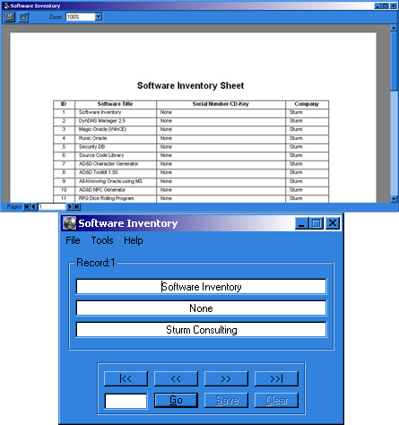



## A Software Inventory Database App

### Description

Very simple application that stores information about software. Stores Title,Serial#/CD-Key, Company/Author. Most significant thing is the use of DAO 3.6 to manipulate the database and write the report for printing. Code is commented, and clean. Limited error-checking and input checking. I do not plan on doing much more with this program, other than use it to keep a list of my own software. Please give me comments, votes NOT needed or requested.
 
### More Info
 

             |
---                |---
**Submitted On**   |2001-06-14 15:36:42
**By**             |[VBScript](https://github.com/Planet-Source-Code/PSCIndex/blob/master/ByAuthor/vbscript.md)
**Level**          |Intermediate
**User Rating**    |4.5 (68 globes from 15 users)
**Compatibility**  |VB 6\.0
**Category**       |[Databases/ Data Access/ DAO/ ADO](https://github.com/Planet-Source-Code/PSCIndex/blob/master/ByCategory/databases-data-access-dao-ado__1-6.md)
**World**          |[Visual Basic](https://github.com/Planet-Source-Code/PSCIndex/blob/master/ByWorld/visual-basic.md)
**Archive File**   |[A Software211546142001\.zip](https://github.com/Planet-Source-Code/vbscript-a-software-inventory-database-app__1-24084/archive/master.zip)

